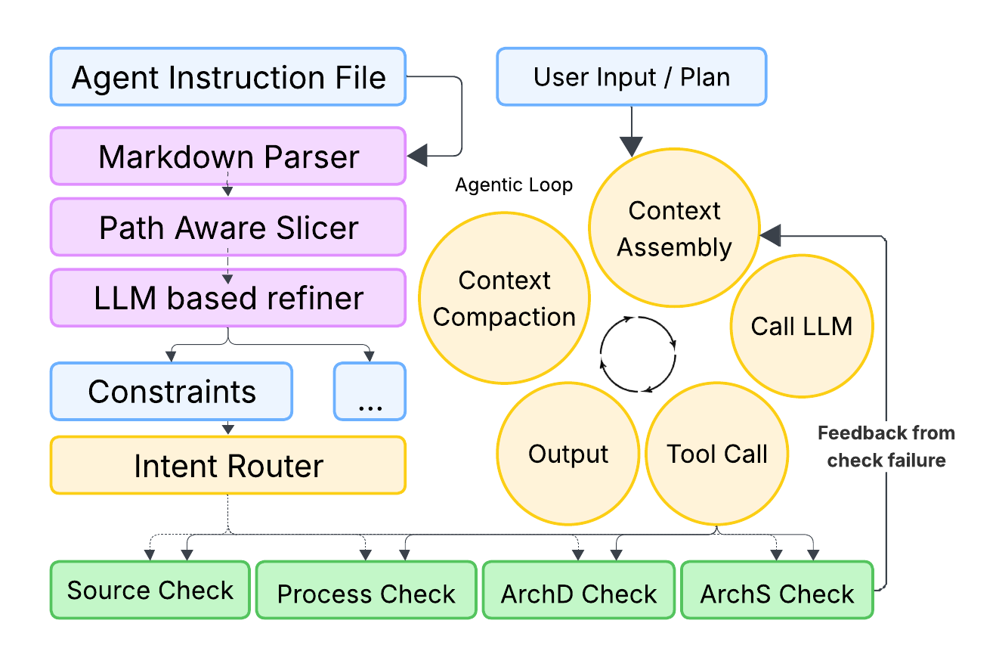

# ContextCov

Your `AGENTS.md` says "never use tab indentation" and "the web layer must not import
from core directly." Nothing enforces that. Coding agents read those files as
suggestions, and reviewers are left checking by hand.

ContextCov compiles the rules in your agent instruction file into **executable
checks** — static analyzers, import-graph queries, and command interceptors — so
the constraints you wrote down actually hold.



The design and an evaluation of this approach are described in the paper:
[**ContextCov** (arXiv:2603.00822)](https://arxiv.org/abs/2603.00822).

## How it works

Two phases:

1. **Generate** — parse `AGENTS.md` / `CLAUDE.md` / `.github/copilot-instructions.md`
   into scoped rules, decide how each one is enforceable, and emit executable
   Python for it. Produces a `*.mapping.json`.
2. **Enforce** — run those checks against your repository.

Each rule is routed to whichever mechanism can actually decide it:

| Check type | Enforced by | Good for |
|---|---|---|
| `SOURCE_CHECK` | Regex and Tree-sitter AST matching over files | "no tab indentation", "every public function needs a docstring" |
| `ARCH_DETERMINISTIC` | Queries over the repository's import graph | "web/ must not import core/", "no import cycles" |
| `ARCH_SEMANTIC` | An LLM reviewing the diff or source | "functions should do one thing" — rules no analyzer can decide |
| `PROCESS_CHECK` | PATH shims that intercept commands before they run | "never run `git push --force`" |

Only generation and `ARCH_SEMANTIC` need an LLM. Static and architectural checks
run offline, so enforcing an existing mapping needs no credentials at all.

## Setup

```bash
python -m venv venv
source venv/bin/activate
pip install -r requirements.txt
```

Requires Python 3.9–3.12. (`tree-sitter-languages` has no 3.13 wheels yet.)

Configure a model for the generation step:

```bash
cp .env.example .env
```

```bash
# Required: provider:model[:temperature]
DEFAULT_LLM=openai:gpt-4o:0.2
OPENAI_API_KEY=sk-...
```

Azure, Gemini, Ollama and the local `claude` CLI are also supported — see
`.env.example` for each provider's variables.

## Quick start

### 1. Generate checks from your instruction file

```bash
python -m src.cli raw/owner/repo/AGENTS.md \
  --local-readme ./AGENTS.md \
  --repo-root .
```

Or point it at a repository on GitHub and let it fetch and clone:

```bash
python -m src.cli https://github.com/owner/repo/blob/main/AGENTS.md
```

This writes `owner_repo_AGENTS.mapping.json` containing every generated check.
Rules that could not be compiled into a check are reported so you know they are
not being enforced.

### 2. Run the checks

```bash
python -m src.scan --mapping owner_repo_AGENTS.mapping.json --root .
```

```
Running source checks...
  Loaded 3 SOURCE_CHECK(s), scanned 4 file(s).
Build Failed (Source):
  core/models.py: Fail if any Python file contains tab characters used for indentation.
  web/views.py: Fail if any public function or class definition is missing a docstring.
Building dependency graph...
  Graph: 10 nodes, 1 edges.
Build Failed (Deterministic):
  [Arch Violation] web/views.py imports core/models.py — web must access core through api/.
One or more check stages failed (see above).
```

Exit code is **0** when everything passes and **1** when any stage fails, so it
drops straight into CI or a pre-commit hook.

Useful flags:

| Flag | Effect |
|---|---|
| `--only-source` | Run only the static checks |
| `--skip-source` | Run only the architectural checks |
| `--no-semantic` | Skip the LLM stage (fully offline) |
| `--repo OWNER/REPO` | Clone and scan in one step |
| `--diff-unstaged` | Scope semantic review to unstaged changes |

Semantic checks review the staged diff, falling back to a full-source snapshot
when there is nothing staged.

### 3. Enforce command rules at runtime

`SOURCE_CHECK` and `ARCH_DETERMINISTIC` inspect code that already exists.
`PROCESS_CHECK` stops a command from running at all. Install the shims:

```bash
python -m src.setup_shims --mapping owner_repo_AGENTS.mapping.json
export PATH="$PWD/.contextcov/bin:$PATH"
```

Now the rule is enforced by the shell:

```
$ git push --force
[ContextCov Violation] AGENTS.md forbids 'git push --force'.
$ git status
On branch main                     # unaffected commands pass straight through
```

Point your coding agent at `.contextcov/runtime/agent_shell.sh` to run it under
the same interception. Add `--dry-run` to see what would be installed first.

Commands the dispatcher itself needs (`bash`, `sh`, `env`, `python3`,
`basename`, `dirname`) cannot be shimmed, and are skipped with a warning.

## Updating checks when your instructions change

Re-run the same generate command after editing your instruction file. ContextCov
updates **incrementally**: each section is keyed by a content hash of its heading
path plus its text, so only sections you actually edited are recompressed,
rerouted and regenerated. Everything else keeps its existing checks and costs no
LLM calls.

```
Instruction file changed since owner_repo_AGENTS.mapping.json was generated; regenerating.
Incremental: reusing 8 unchanged segment(s), processing 1 new or changed.
```

Adding, removing or reordering sections does not invalidate the others. If
nothing changed, the run is a no-op.

| Flag | Effect |
|---|---|
| *(none)* | Reuse unchanged sections; regenerate only what changed |
| `--force` | Re-run even when already up to date (still incremental) |
| `--no-reuse` | Full rebuild of every section |

## Configuration

`DEFAULT_LLM` sets the model for every stage. Any stage can override it:

| Variable | Stage |
|---|---|
| `DEFAULT_LLM` | Default for all stages (required) |
| `COMPRESSION_LLM` | Rewriting each section into a single constraint |
| `ROUTER_LLM` | Choosing which check type a constraint becomes |
| `STATIC_CHECK_LLM` | Generating `SOURCE_CHECK` code |
| `PROCESS_CHECK_LLM` | Generating `PROCESS_CHECK` code |
| `ARCH_DETERMINISTIC_LLM` | Generating import-graph queries |
| `ARCH_SEMANTIC_LLM` | Running semantic review |

Format is `provider:model[:temperature]`. Set `CONTEXTCOV_MAX_CONCURRENCY` to
control parallel requests (default 5), and `LLM_CACHE_ENABLE=1` to cache
responses across runs.

## Security

**ContextCov generates Python with an LLM and then executes it.** Generated
checks run via `exec()` in your own process with your privileges, during
generation (a validation dry-run), during `src.scan`, and inside the PATH shims.
Run it on repositories and instruction files you trust, and review a mapping
before enforcing it — the generated code is plain Python and is meant to be read.

The `claudecode` provider invokes the `claude` CLI with
`--dangerously-skip-permissions` so it can run unattended.

## Project structure

```
src/
  cli.py                    Generate checks from an instruction file
  scan.py                   Run checks against a repository
  setup_shims.py            Install PATH interception for PROCESS_CHECK
  markdown_chunks.py        Parse markdown into scoped segments
  stable_id.py              Content-addressed segment IDs (incremental updates)
  contextual_compression.py Rewrite a section into one constraint
  router.py                 Route a constraint to a check type
  *_generator.py            Generate code for each check type
  static_runner.py          Execute SOURCE_CHECKs (regex + Tree-sitter)
  graph_builder.py          Build the import graph
  arch_runner.py            Execute architectural checks
  contextcov_runtime/       Shim dispatcher and process-check runner
llm.py                      Provider clients and model configuration
```

## Testing

```bash
pytest tests/
```

## Paper

ContextCov is described in [arXiv:2603.00822](https://arxiv.org/abs/2603.00822),
which covers the design of the synthesis pipeline and an evaluation of the
generated checks.

## License

MIT — see [LICENSE](LICENSE).
